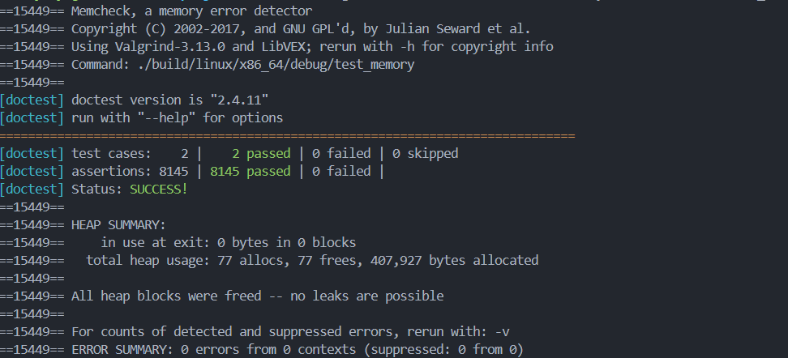
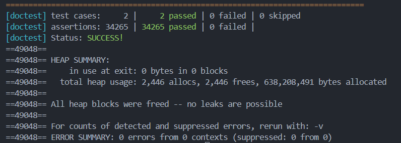

# mCoroutine

## 项目描述

### 简介

A tiny asymmetric stacked coroutine library uses modern C++, based on OOP and RAII ideas. Adopt a pooling approach to resource management and provide convenient API such as coroutine creation/calls/reclaim operation.

### 项目目录结构

```c++

//   out/include/coroutine ----- fmtlog/                --> a fast fmt style log library(C++17)
//                  | ----- coctx.h                     --> coroutine regs define
//                  | ----- utils.h                     --> global define(macro...)
//                  | ----- memory.h                    --> memory pool(unified memory management)
//                  | ----- coroutine.h                 --> coroutine operator define
//                  | ----- coroutine_pool.h            --> coroutine pool define
//                  | ----- coroutine_hook.h            --> some coroutine hook function (in mRPC)
//
//   out/lib/libmcoroutine.a                            --> use (c++17) (linux static library) (default) 
//                                                      --> modify the xmake.lua to make others version
//
//   include/doctest/doctest.h                          --> add when runing test file
//                                                      --> https://github.com/doctest/doctest
```

> **实现思路及更多原理性整理参考** [**conclusion**](./doc/conclusion/conclusion.md)

### 开发环境

```shell
# gcc-12.3.0 + vscode + ssh + clangd

uname -a
# Linux ubuntu 5.4.0-150-generic #167~18.04.1-Ubuntu SMP Wed May 24 00:51:42 UTC 2023 x86_64 x86_64 x86_64 GNU/Linux
```

### C++ 编译版本

项目中通过使用宏扩展等实现对于多版本的支持，支持使用 C++11/C++14/C++17 版本进行编译&nbsp;
* C++11 编译版本即最基础版本，实现协程库基本功能，支持常规协程操作
* C++14 编译版本添加使用 make_unique 进行 unique_ptr 的构造，保证异常安全
* C++17 编译版本引入 [**fmt**](https://github.com/fmtlib/fmt) 风格的高性能异步日志库 [**fmtlog**](https://github.com/MengRao/fmtlog)，支持日志打印输出等功能

## 测试记录

### 测试环境

测试使用开源测试框架 [**doctest**](https://github.com/doctest/doctest) 以及内存检查工具 **valgrind** 进行。

### Test Memory Pool
#### **Problem No.1**


> **更新：阅读完 unique_ptr 源码后发现新的写法，原问题解决**
```c++
// uinque_ptr 包含两种实现
// https://en.cppreference.com/w/cpp/memory/unique_ptr

template< class T, class Deleter = std::default_delete<T>> 
class unique_ptr;

template <class T, class Deleter> 
class unique_ptr<T[], Deleter>;
```

其中第二种写法专门可用于处理数组类型构造的情况，此时对应的 make_unique 函数有
```c++
// make_unique 两种实现
// https://en.cppreference.com/w/cpp/memory/unique_ptr/make_unique

template< class T, class... Args >
unique_ptr<T> make_unique( Args&&... args );
// => std::make_unique<T>(args)

template<class T>
unique_ptr<T> make_unique( std::size_t size );
// => std::make_unique<T[]>(size)
```
故对于处理 unique_ptr 的宏扩展可以进一步定义为：

```c++
#if __cplusplus >= 201402L

#define MAKE_UNIQUE(T, args...) \
    std::make_unique<T>(args)

#define MAKE_UNIQUE_ARRAY(T, size) \
    std::make_unique<T[]>(size)

#else

#define MAKE_UNIQUE(T, args...) \
    std::unique_ptr<T>(new T(args))

#define MAKE_UNIQUE_ARRAY(T, size) \
    std::unique_ptr<T[]>(new T[size])
#endif
```

**旧：一个关于使用 unique_ptr 进行连续内存管理的问题**&nbsp;

在使用 unique_ptr 进行连续内存块管理（即管理由 malloc 等分配的连续堆上空间，返回首指针。如此处为 uint8_t*，标识一整段内存）时，不能使用如下写法

```c++

    // a so easy problem can't like a problem
    // make_unique<uint8_t>(size)
    // unique_ptr<uint8_t*>(new uint8_t(size))

```
因为 unique_ptr 本身是用于单个堆上对象的内存管理的（对于连续对象可以采用 vector 进行处理）。此处是为了节省指针空间（内存池中连续 block_group_size 个内存块使用一个共同的首地址），才强行进行了此处使用 unique_ptr 管理连续内存的处理。

```c++
// memory.h line 14~17

class MemoryBlockGroup {

/*
    ......
*/

public:
	std::unique_ptr<uint8_t, free_delete> m_start;
	std::vector<bool> m_use_flags{};
};
```
因此在此处需要使用 malloc 首先进行内存分配，此后再将 malloc 返回指针 (void*) 类型转换为 (uint8_t*) 类型，即如下写法:

```c++
// memory.cc line 16

m_start = std::unique_ptr<uint8_t, free_delete>(static_cast<uint8_t*>(malloC(block_group_size * block_size)));	
```

此外，对于 unique_ptr ，需要自定义删除器，以实现对于连续地址空间的正确释放，防止内存泄漏。
```c++
// memory.h line 14~17

class MemoryBlockGroup {

public:
	struct free_delete {
		void operator()(void* x) { free(x); }
	};

/*
    ......
*/

};
```

> **对于智能指针相关的整理可以参考** [**conclusion**](./doc/conclusion/conclusion.md)

#### bug free && memory check



### Coroutine Pool && Coroutine

#### **problem No.1**

**一个很奇怪的坑，vector reserve 会调用拷贝构造？**&nbsp;

在一般理解下对于 vector 的 reserve 函数，其仅负责对于内存空间的扩张，而并不负责元素的构造，而对于 vector 的 emplace_back 函数，其在元素所在空间位置直接使用输入参数进行元素的构造，因此均不会调用拷贝或移动构造函数等构造函数。

但在如下代码位置出现了问题：

```c++
// coroutine_pool.cc line 107~109 (reserver and emplace_back new coroutine)

// m_coroutines.reserve(static_cast<uint32_t>(1.5 * new_size));
for(uint32_t i = m_coroutines.size(); i <= new_size; i++)
    m_coroutines.emplace_back(false, m_stack_size, m_memory_pool->getBlock());
```
这里发现 reserve 函数其在 vector 不为空时使用会调用一次拷贝构造&nbsp;

[**Stackoverflow Link: Why does std::vector::reserve call the copy constructor?**](https://stackoverflow.com/questions/27470827/why-does-stdvectorreserve-call-the-copy-constructor?newreg=662f889601db4a8eaf13003fefe02a2d)

因此选择在此处进行修改，因为此处仅有一个添加，显式进行 reserve 调用意义不大，故直接删除，但是在删除后发现，对于容器内元素类型执行如下显示删除拷贝构造函数后，其仍会存在编译不通过问题 **(clang-14.0.0 && gcc-7.5.0)**。

```c++
// coroutine_pool.h line 46~48 (delete copy construct)

CoroutinePair(const CoroutinePair& rhs) = delete;
CoroutinePair& operator=(const CoroutinePair& rhs) = delete;
```

```shell
error: /usr/lib/gcc/x86_64-linux-gnu/7.5.0/../../../../include/c++/7.5.0/bits/stl_construct.h:75:38: error: call to deleted constructor of 'mcoroutine::CoroutinePool::CoroutinePair'
    { ::new(static_cast<void*>(__p)) _T1(std::forward<_Args>(__args)...); }
                                     ^   ~~~~~~~~~~~~~~~~~~~~~~~~~~~
/usr/lib/gcc/x86_64-linux-gnu/7.5.0/../../../../include/c++/7.5.0/bits/stl_uninitialized.h:83:8: note: in instantiation of function template specialization 'std::_Construct<mcoroutine::CoroutinePool::CoroutinePair, mcoroutine::CoroutinePool::CoroutinePair>' requested here
                std::_Construct(std::__addressof(*__cur), *__first);
                     ^
/usr/lib/gcc/x86_64-linux-gnu/7.5.0/../../../../include/c++/7.5.0/bits/stl_uninitialized.h:134:2: note: in instantiation of function template specialization 'std::__uninitialized_copy<false>::__uninit_copy<std::move_iterator<mcoroutine::CoroutinePool::CoroutinePair *>, mcoroutine::CoroutinePool::CoroutinePair *>' requested here
        __uninit_copy(__first, __last, __result);
        ^
/usr/lib/gcc/x86_64-linux-gnu/7.5.0/../../../../include/c++/7.5.0/bits/stl_uninitialized.h:289:19: note: in instantiation of function template specialization 'std::uninitialized_copy<std::move_iterator<mcoroutine::CoroutinePool::CoroutinePair *>, mcoroutine::CoroutinePool::CoroutinePair *>' requested here
    { return std::uninitialized_copy(__first, __last, __result); }
                  ^
/usr/lib/gcc/x86_64-linux-gnu/7.5.0/../../../../include/c++/7.5.0/bits/stl_vector.h:1263:13: note: in instantiation of function template specialization 'std::__uninitialized_copy_a<std::move_iterator<mcoroutine::CoroutinePool::CoroutinePair *>, mcoroutine::CoroutinePool::CoroutinePair *, mcoroutine::CoroutinePool::CoroutinePair>' requested here
              std::__uninitialized_copy_a(__first, __last, __result,
                   ^
/usr/lib/gcc/x86_64-linux-gnu/7.5.0/../../../../include/c++/7.5.0/bits/vector.tcc:73:20: note: in instantiation of function template specialization 'std::vector<mcoroutine::CoroutinePool::CoroutinePair>::_M_allocate_and_copy<std::move_iterator<mcoroutine::CoroutinePool::CoroutinePair *>>' requested here
          pointer __tmp = _M_allocate_and_copy(__n,
  > in src/coroutine_pool.cc

```
而诡异的是，在取消显式删除，设置断点进行调试时，并不会产生对此处两个拷贝构造函数的调用（此前提到的 reserve 在vector 不为空时确实是可以捕捉到调用的），也就是说它两存在的唯一意义就是存在。此处也无法确定是否是编译器 bug 或者说是语言未定义行为，故在此简单记录一下困惑。 

#### bug free && memory check




## 使用手册

使用大致可以参考测试用例中实现，比较推荐使用组件自带协程池进行协程管理

```c++

// step No.1: Config
// Global singleton config structure
mcoroutine::Config::SetGlobalConfig(0 /* pool_size default(128)*/, 4096 /* stack_size default(1024*128)*/);
// mcoroutine::Config::GetGlobalConfig()   // -> get config

// step No.2: CoroutinePool && Get Coroutine
// Global singleton Coroutine Pool structure
auto test_pool = mcoroutine::CoroutinePool::GetGlobalCoroutinePool();
auto test_cor = test_pool->getCoroutine();      // -> get coroutine

// step No.3: set callback function
test_cor->setCallBack([&]() {

    /*
        ......
        coroutine callback_function()
    */

    // can return main coroutine in everywhere
    mcoroutine::Coroutine::Yield();

});

// step No.4: Resume
// Resume to the coroutine can Resume
mcoroutine::Coroutine::Resume(test_cor);

// ......
// when the callback is completed, it will yield to main coroutine automatic

// step No.5: Back
// Need to call bcakCoroutine to back Coroutine
test_pool->backCoroutine(test_cor);

```
